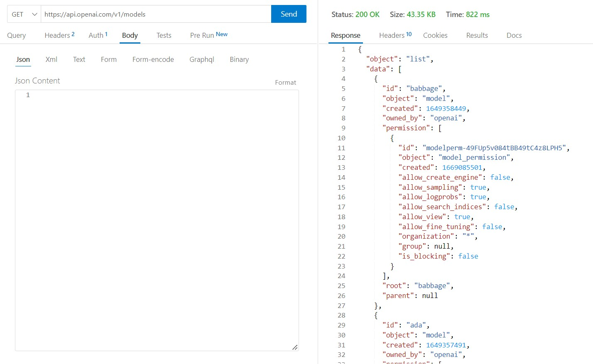

<!-- TABLA DE CONTENIDOS -->

  
Tabla de Contenidos

  <ol>
    <li><a href="Ejercicios REST">Ejercicios REST</a></li>
    <li><a href="Generador de nombres">Generador de nombres</a></li>
    <li><a href="Generador de imágenes">Generador de imágenes</a></li>
  </ol>

# 1. Ejercicios REST

Realizamos solicitudes a la API de OpenAI utilizando el cliente Thunder Client.

## 1.1. Ejercicio 1 - Obtener los modelos disponibles

Este ejercicio es para enumerar y describir los diversos modelos disponibles en la API.

Para ello, debemos realizar una solicitud **GET** a la siguiente URL: https://api.openai.com/v1/models

## 1.2. Ejercicio 2 - Obtener información de un modelo

Este ejercicio es para obtener información de un modelo en particular.

Para ello, debemos realizar una solicitud **GET** a la siguiente URL: https://api.openai.com/v1/models/curie

## 1.3. Ejercicio 3 - Obtener una imagen

Este ejercicio es para obtener una imagen según nuestras indicaciones.

Para ello, debemos realizar una solicitud **POST** a la siguiente URL: https://api.openai.com/v1/images/generations

Como se ve en la imagen hemos tenido que especificar en el *body* algunos parámetros:

- `prompt`: Una descripción de la imagen que queremos obtener.
- `n`: El número de imágenes que se generarán.
- `size`: El tamaño de la imagen que se generará.

## 1.4. Ejercicio 4 - Obtener una terminación

Este ejercicio es para obtener una terminación según nuestras indicaciones.

Para ello, debemos realizar una solicitud **POST** a la siguiente URL: https://api.openai.com/v1/completions

Como se muestra en la imagen, volvemos a tener que especificar en el *body* algunos parámetros que ya hemos nombrado, pero solo especificaremos los nuevos:

- `model`: ID del modelo a utilizar.
- `max_tokens`: El número máximo de tokens que se generarán.
- `temperature`: La temperatura que se utilizará para el muestreo.
- `top_p`: El valor de top-p que se utilizará para el muestreo.
- `stream`: Transmite los resultados a medida que se generan.
- `logprobs`: Probabilidades de logaritmo de cada token devuelto.
- `stop`: Una lista de tokens que indican dónde detener la generación.

## 1.5. Ejercicio 5 - Obtener una moderación

Este ejercicio es para clasificar si el texto viola la Política de contenido de OpenAI.

Para ello, debemos realizar una solicitud **POST** a la siguiente URL: https://api.openai.com/v1/moderations

En este caso, en el *body* de la solicitud debemos especificar el texto de entrada a clasificar.

# 2. Generador de nombres

Hemos creado el código del generador de nombres para que funcione correctamente en el archivo **pet.js**.

A continuación, comprobamos como funciona:

# 3. Generador de imágenes

Hemos creado el código del generador de nombres para que funcione correctamente en el archivo **image.js**.

A continuación, comprobamos como funciona:

